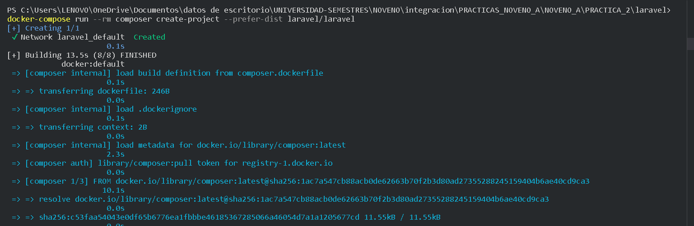
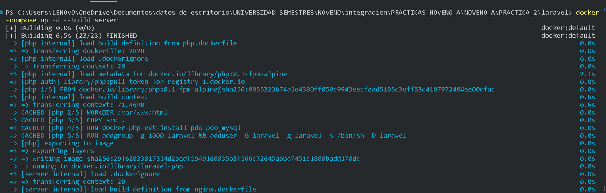
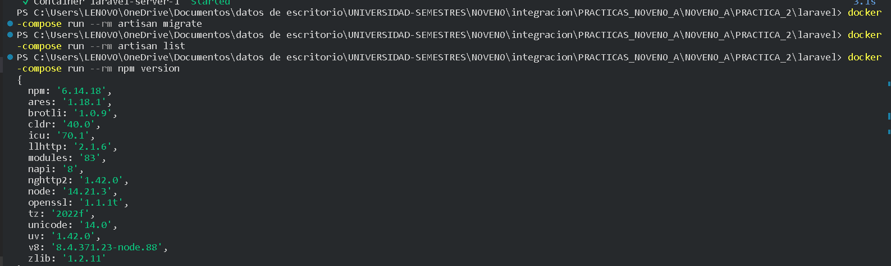

*PRACTICA LARAVEL

* docker-compose run --rm composer create-project --prefer-dist laravel/laravel .

//ahora lo quiero correr
docker-compose up -d --build server

//migrar artisan
* docker-compose run --rm artisan migrate
docker-compose run --rm artisan list
docker-compose run --rm npm version
