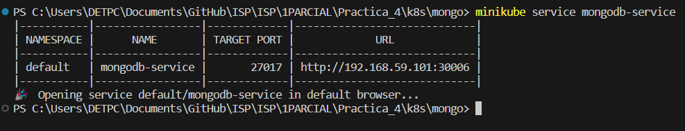
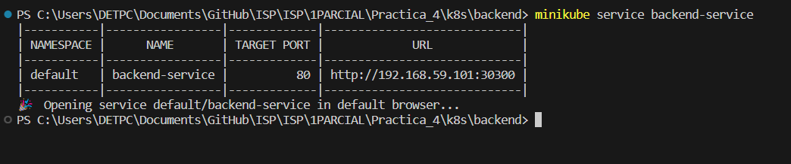
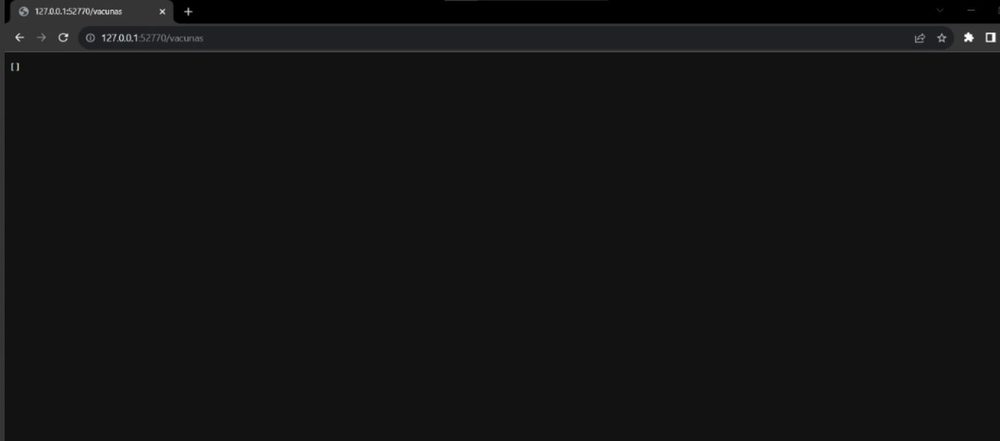
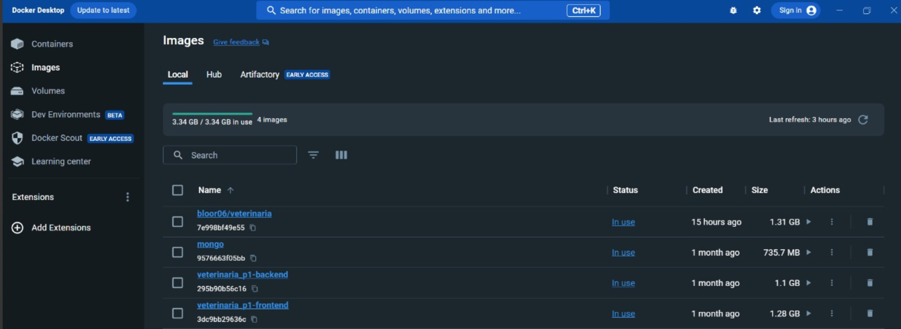

# ISP
# PRÁCTICA IV
## INTEGRANTES 
* LOOR BARRETO BORIS LEONEL
* LÓPEZ BASURTO LARISSA YULIANA 
* MACHUCA CATAGUA NAHOMI ANAHY
* SANTANA MINAYA MARÍA JOSÉ
* TRIVIÑO RAMOS NICOLLE ALEXANDRA
* VILLAMAR ALCÍVAR MARÍA BELÉN
***

##### A continucación, se adjunta evidencias de la cuarta práctica relacionada con la configuración utilizando Minikube: 

- Servicios de Mongobd y backend

- Servicio expuesto dentro de tu clúster de Kubernetes local a través de tu navegador

- Imagen de contenedor de Docker 

